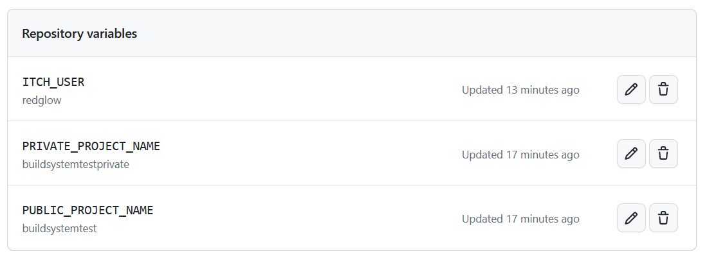

# CI/CD with Godot 4 + C# + itch

This is a small repo demonstrating a possible CI/CD[^1] setup using a Godot 4 C# example project.

The workflows do the following work:
- whenever a new commit is pushed, a dev release of all the platforms is pushed on a game with a restricted access on itch.
- whenever a tag with a semantic version[^2] is pushed, a release with the same version number is pushed on a public project.

I found this approach practical in order to have a kind of "nightly" build that can be accessed only by testers / internal devs, and a public build containing the released versions.

## Limitations

This project has been tested only on Godot 4.1.1, with a C# project, and producing a Linux and Windows build. Other configurations could easily not work!

The Godot workflow used doesn't support parallel compilation right now, but there's a pull request on the way for that.

## How do I use it?

Copy the `.github/workflows` directory contents to your project, and then go to your GitHub project and fill these values in Settings &rarr; Secrets and variables &rarr; Actions.

- Secret `BUTLER_CREDENTIALS`, as instructed by [manleydev/butler-publish-itchio-action](https://github.com/yeslayla/butler-publish-itchio-action#butler_credentials-required)
- Variable `ITCH_USER`, your itch user
- Variable `PRIVATE_PROJECT_NAME`, the name of the restricted game on itch
- Variable `PUBLIC_PROJECT_NAME`, the name of the public game on itch

After this, it's very likely you will need to personalize it further. Read below to understand how it works, so you know where to operate.

## How does it work?

Mostly thanks to the work of other people!

- [firebelley/godot-export](https://github.com/firebelley/godot-export) does most of the job, creating the exports of the projects,
- [manleydev/butler-publish-itchio-action](https://github.com/yeslayla/butler-publish-itchio-action) publishes the releases to itch,
- and [damienaicheh/extract-version-from-tag-action](https://github.com/damienaicheh/extract-version-from-tag-action) extracts the tag from the git repository.

The main workflow is `export_game.yml`. The first job (`export_game`) checks out the project, builds the dotnet part, exports it for windows and linux, and uploads the produced exports as artifacts. This way two consecutive jobs (`upload_to_itch_windows` and `upload_to_itch_linux`) can pick up the artifacts and upload them to itch.

This main workflow is called by `dev.yml` and `release.yml`. The first one is activated on every push, and just calls the main workflow pointing to the restricted game. `release.yml`, instead, is triggered only when a tag containing a semver[^2] pattern starting with "v" is pushed, and first checks out the project to compute the current version, then calls `export_game.yml` passing the version and the public game.

## An example

Well, this repo is the example.

You can find the [public game here](https://redglow.itch.io/buildsystemtest), and the [restricted game here](https://redglow.itch.io/buildsystemtestprivate) (with password "buildsystem").

[^1]: (actually, only the "CD" part)
[^2]: only versions in the form vMajor.Minor.Patch are supported right now, nothing fancier